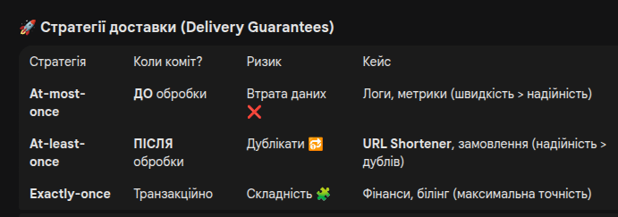

🏗️ Основні поняття Apache Kafka
📂 Topic (Топік)
Це логічний канал або «папка», куди надсилаються повідомлення.

На відміну від черг у RabbitMQ, повідомлення в топіку не видаляються після прочитання. Вони зберігаються протягом налаштованого часу (Retention Policy).

🍰 Partition (Партіція)
Це фізична одиниця масштабування. Один топік розбивається на кілька партіцій.

Повідомлення всередині партіції мають суворий порядок.

Партіції дозволяють кільком консюмерам читати дані з одного топіка паралельно.

✍️ Producer (Продюсер)
Додаток, який публікує (пише) дані в топіки. Продюсер вирішує, у яку партіцію відправити повідомлення (зазвичай на основі ключа повідомлення).

🧐 Consumer (Консюмер)
Додаток, який підписується на топіки та читає повідомлення. Консюмер сам знає, на якому місці він зупинився.

👥 Consumer Group (Група споживачів)
Набір консюмерів, які працюють разом як одна команда.

Кожна партіція топіка обробляється лише одним консюмером всередині групи.

Це дозволяє горизонтально масштабувати обробку даних.

📍 Offset (Офсет)
Це унікальний номер (ID) повідомлення всередині партіції.

Це як «закладка» в книзі: консюмер зберігає свій офсет, щоб знати, 
звідки продовжити читання після перезавантаження.

🏢 Broker (Брокер)
Це сервер Kafka. Кластер Kafka складається з одного або декількох брокерів. 
Вони відповідають за зберігання повідомлень та обробку запитів від продюсерів і консюмерів.

🏁 Commit (Коміт)
Процес фіксації офсета в Kafka. Коли консюмер «комітить» офсет, він каже: 
«Я успішно обробив усі повідомлення до цього номера».

