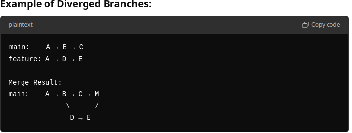
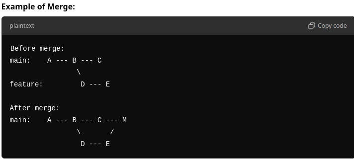
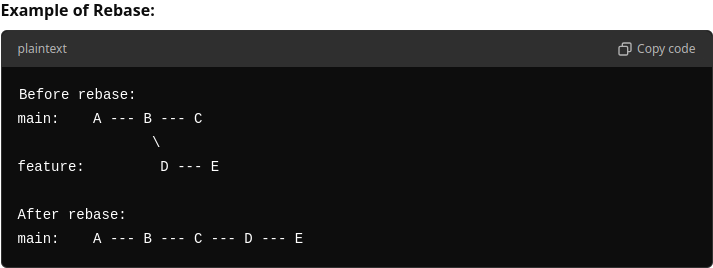

# Git Overview

Git is a distributed version control system (VCS). It tracks changes in files, 
enabling collaboration and version management.

## Main Principles

- **Repository**: A project that Git tracks.
- **Commit**: A snapshot of changes with a message.
- **Branch**: A separate line of development.
- **Merge**: Combine branches together.
- **Clone**: Copy a repository to your local machine.
- **Pull**: Update your local copy from a remote repository.
- **Push**: Send local changes to the remote repository.

# Branch vs Tag in Git

## Branch
- **Definition**: A pointer to the latest commit in a series of changes.
- **Usage**: For ongoing development. You can add new commits.
- **Movable**: Moves forward as new commits are added.
- **Examples**: `main`, `feature-x`, `bugfix-123`.

## Tag
- **Definition**: A reference to a specific commit, typically used for marking releases.
- **Usage**: For creating static snapshots (e.g., `v1.0`).
- **Immovable**: Remains fixed at the commit where it's created.
- **Examples**: `v1.0`, `release-2023`.

In Git, fast-forward is a type of merge that occurs when the current branch has not diverged from 
the branch being merged into it. Just pointer is moved, no merge commit.

No fast-forward (with merge commit):

Ra-base vs Merge:

In Git, cherry-pick is a command that allows you to apply a specific 
commit from one branch into another, without merging the entire branch. 
It’s useful when you want to selectively incorporate individual changes 
from one branch into another.

