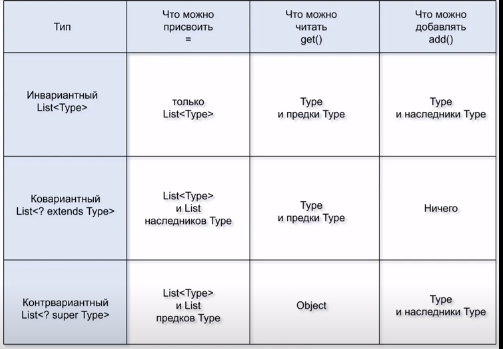

`Covariance` is a restriction in java related to having the same
type of reference type and object in generic object declaration:

`List<Person> studentList = new ArrayList<Student>();`

If it were possible then we would not be able to rely on generics,
type consistency would be broken.

`Covariance` - is an ability with help of `? extends <smthn>`
to a method parameter to allow to read type and it's parent. 
It's not possible to add anything to such a list. 
It's possible to assign just type and it's children.

`Contrvariance` - is an ability with help of `? super <smthn>`
to a method parameter to add type or it's children to such a list.
Can read just object. Can assign just the same type or subtypes.

`PECS` - Produces Extends Consumer Super

